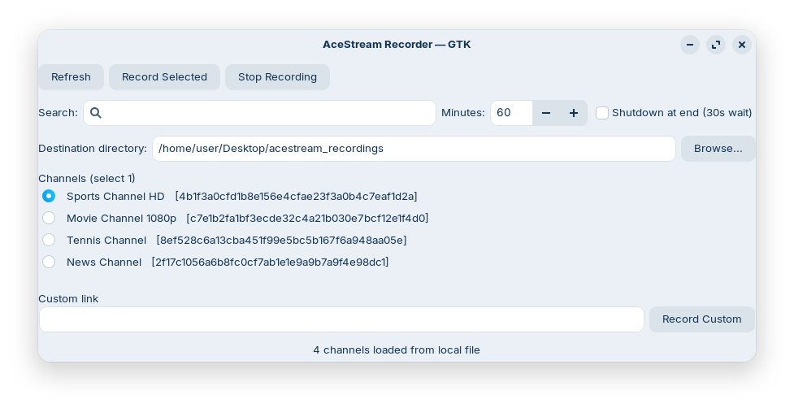

# AceStream Recorder

A Python GUI application for recording AceStream channels with automatic conversion to MP4 format.



## Features

- **Modern GUI**: Uses GTK (with PyGObject) or Tkinter/TtkBootstrap as fallback
- **Channel Management**: Load channels from a local JSON file
- **Search & Filter**: Quickly find channels by name or hash
- **Flexible Recording**:
  - Record any channel from the list
  - Record custom AceStream hashes
  - Set recording duration in minutes
- **Automatic Conversion**: Converts recorded TS files to MP4 using ffmpeg
- **Output Management**: Choose custom output directories
- **Optional Shutdown**: Automatically shutdown computer after recording
- **Desktop Integration**: Includes .desktop file for application menu integration

## Requirements

### Core Dependencies
- Python 3.6+
- AceStreamPlayer (snap package)
- ffmpeg (for video conversion)

### Python Packages
The script will use one of these GUI toolkits:
- **Preferred**: PyGObject (GTK 3) - `python3-gi` and `gir1.2-gtk-3.0`
- **Fallback**: ttkbootstrap or tkinter

### Installation on Ubuntu/Debian

```bash
# Install system dependencies
sudo apt update
sudo apt install python3-gi python3-gi-cairo gir1.2-gtk-3.0 ffmpeg

# Install AceStreamPlayer (snap version)
sudo snap install acestreamplayer

# Clone or download the script
git clone https://github.com/g8998/acestream-recorder.git
cd acestream-recorder
```

## Configuration

### Channel List
Create a `channels.json` file in the same directory as the script:

```json
[
  {
    "channel": "Channel Name 1",
    "link": "acestream://hash_here_1"
  },
  {
    "channel": "Channel Name 2", 
    "link": "acestream://hash_here_2"
  }
]
```

### Path Configuration
The script uses these default paths (modify in script if needed):
- **Engine**: `/var/lib/snapd/snap/bin/acestreamplayer.engine`
- **Player**: `/var/lib/snapd/snap/bin/acestreamplayer.mpv`
- **Output Directory**: `~/Desktop/acestream_recordings`

## Usage

1. **Start the application**:
   ```bash
   python3 acestream_recorder.py
   ```

2. **Load channels**:
   - Click "Refresh" to load from `channels.json`
   - Channels appear in the list with their hashes

3. **Configure recording**:
   - Select a channel by clicking its radio button
   - Set recording duration in minutes
   - Choose output directory (browse or type path)
   - Optional: Enable "Shutdown at end"

4. **Start recording**:
   - Click "Record Selected" for selected channel
   - Or enter a custom hash and click "Record Custom"
   - Use "Stop Recording" to interrupt

5. **Find recordings**:
   - TS files (raw) and MP4 files (converted) appear in output directory
   - Files are named: `acestream_[channel]_[timestamp].ts/mp4`

## Desktop Integration

### Creating a Desktop Launcher

1. **Create a desktop file** in `~/.local/share/applications/`:

```bash
mkdir -p ~/.local/share/applications/
nano ~/.local/share/applications/acestream-recorder.desktop
```

2. **Copy this content** (adjust paths as needed):

```desktop
[Desktop Entry]
Version=1.0
Type=Application
Name=AceStream Recorder
Comment=Record AceStream channels with GUI
Exec=python3 /PATH/TO/YOUR/AceStream-Recorder/acestream_recorder.py
Icon=/PATH/TO/YOUR/AceStream-Recorder/icon.png
Terminal=false
Categories=AudioVideo;Recorder;
Keywords=acestream;record;video;
```

3. **Make it executable**:
```bash
chmod +x ~/.local/share/applications/acestream-recorder.desktop
```

4. **Create an icon** (optional):
   - Include a `icon.png` file (128×128 pixels recommended) in the project folder
   - Or use a system icon: `Icon=media-record`

### Pre-made Desktop File

The repository includes `acestream-recorder.desktop` with the following content:

```desktop
[Desktop Entry]
Version=1.0
Type=Application
Name=AceStream Recorder
GenericName=AceStream Recording Tool
Comment=Record AceStream channels with GUI interface
Exec=python3 %h/AceStream-Recorder/acestream_recorder.py
Icon=%h/AceStream-Recorder/icon.png
Terminal=false
Categories=AudioVideo;Recorder;Video;
Keywords=acestream;record;streaming;video;
StartupNotify=true
MimeType=
Path=%h/AceStream-Recorder
```

To install it system-wide:

```bash
# Copy to system applications directory
sudo cp acestream-recorder.desktop /usr/share/applications/

# Or for user-only installation
cp acestream-recorder.desktop ~/.local/share/applications/
```

### Script Permissions

Make the script executable for easier launching:
```bash
chmod +x acestream_recorder.py
```

Now you can launch AceStream Recorder from your application menu!

## Application Screenshot

The application features a clean interface with:
- Top toolbar with action buttons
- Search box for filtering channels
- Channel list with selection radio buttons
- Configuration options (duration, shutdown, output directory)
- Custom hash input field
- Status bar at the bottom

## Troubleshooting

### Common Issues

1. **"Player not found" error**:
   - Ensure AceStreamPlayer snap is installed: `sudo snap install acestreamplayer`
   - Check the path in the script constants matches your installation

2. **No channels appearing**:
   - Verify `channels.json` exists in the script directory
   - Check JSON format is valid (must be an array of objects)

3. **Recording fails or produces empty files**:
   - Ensure AceStream engine is running (the script tries to start it automatically)
   - Check your internet connection
   - Verify the AceStream hash is still valid

4. **MP4 conversion fails**:
   - Ensure ffmpeg is installed: `sudo apt install ffmpeg`
   - Check file permissions on output directory

5. **Desktop launcher doesn't appear**:
   - Ensure the .desktop file is in the correct directory
   - Run `update-desktop-database ~/.local/share/applications/` to refresh
   - Check file permissions: `chmod +x acestream-recorder.desktop`

### GUI Toolkit Issues

- **GTK not available**: The script will automatically fall back to Tkinter/TtkBootstrap
- **Missing dependencies**: Install required packages for your chosen toolkit

## Project Structure

```
AceStream-Recorder/
├── acestream_recorder.py       # Main application script
├── channels.json               # Channel configuration (create this)
├── acestream-recorder.desktop  # Desktop launcher file
├── icon.png                    # Application icon (128×128, optional)
├── screenshot.png              # Application screenshot
└── README.md                   # Documentation
```

## Contributing

1. Fork the repository
2. Create a feature branch
3. Make your changes
4. Submit a pull request

Please ensure your code follows PEP 8 style guidelines.

## License

This project is licensed under the **GNU General Public License v3.0 (GPL-3.0)** - see below for details.

### Why GPL-3.0?
This license ensures that:
- The software remains free and open source
- Modifications must also be open source
- Users have the freedom to use, study, share, and improve the software

For more details, see the [GNU GPL v3.0 license text](https://www.gnu.org/licenses/gpl-3.0.html).

## Disclaimer

This tool is for personal use only. Please ensure you have the right to record any content. The developers are not responsible for any misuse of this software or copyright infringement.
